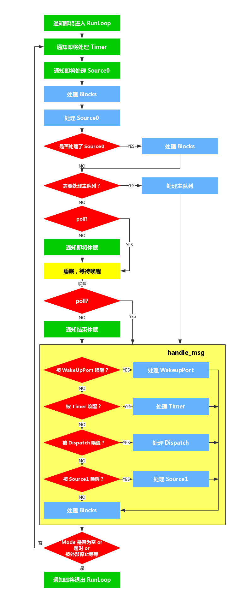

[toc]

# RunLoop 相关概念
## Event Loop
事件循环模型，实现这种模型的关键点在于：如何管理事件/消息，如何让线程在没有处理消息时休眠以避免资源占用、在有消息到来时立刻被唤醒

```objc
function loop() 
{
    init();
    do 
    {
        var message = get_next_message();
        process_message(message);
    }
    while (message != quit);
}
```

线程执行了这个函数后，就会一直处于这个函数内部 “接受消息->等待->处理” 的循环中，直到这个循环结束

RunLoop 就是 OSX/iOS 平台对事件循环模型的实现，在循环中用来处理程序运行过程中出现的各种事件（比如说触摸事件、UI 刷新事件、定时器事件）和消息，从而保持程序的持续运行；而且在没有事件处理的时候，会进入睡眠模式，从而节省 CPU 资源，提高程序性能

## NSRunLoop 和 CFRunLoop
OSX/iOS 系统中，提供了两个这样的对象：NSRunLoop 和 CFRunLoop

CFRunLoop 是 Core Foundation 框架内的，它提供了纯 C 函数的 API，所有这些 API 都是线程安全的

NSRunLoop 是 Foundation 框架内的，提供了面向对象的 API，但是这些 API 不是线程安全的

其中 NSRunLoop 是对 CFRunLoop 的简单封装，需要着重研究的只有 CFRunLoop

更准确的说，代码里面是 `CFRunLoopRef`，本文统一简称为 `CFRunLoop`

# RunLoop 与线程的关系
苹果不允许直接创建 RunLoop，它只提供了两个自动获取的函数：

Core Foundation 框架中的获取方法：CFRunLoopGetMain() 和 CFRunLoopGetCurrent()

Foundation 框架中的获取方法：[NSRunLoop mainRunLoop] 和 [NSRunLoop currentRunLoop]

代码逻辑如下：

```c
/// 全局的Dictionary，key 是 pthread_t， value 是 CFRunLoopRef
static CFMutableDictionaryRef loopsDic;
/// 访问 loopsDic 时的锁
static CFSpinLock_t loopsLock;
 
/// 获取一个 pthread 对应的 RunLoop。
CFRunLoopRef _CFRunLoopGet(pthread_t thread) {
    OSSpinLockLock(&loopsLock);
    
    if (!loopsDic) {
        // 第一次进入时，初始化全局Dic，并先为主线程创建一个 RunLoop。
        loopsDic = CFDictionaryCreateMutable();
        CFRunLoopRef mainLoop = _CFRunLoopCreate();
        CFDictionarySetValue(loopsDic, pthread_main_thread_np(), mainLoop);
    }
    
    /// 直接从 Dictionary 里获取。
    CFRunLoopRef loop = CFDictionaryGetValue(loopsDic, thread));
    
    if (!loop) {
        /// 取不到时，创建一个
        loop = _CFRunLoopCreate();
        CFDictionarySetValue(loopsDic, thread, loop);
        /// 注册一个回调，当线程销毁时，顺便也销毁其对应的 RunLoop。
        _CFSetTSD(..., thread, loop, __CFFinalizeRunLoop);
    }
    
    OSSpinLockUnLock(&loopsLock);
    return loop;
}
 
CFRunLoopRef CFRunLoopGetMain() {
    return _CFRunLoopGet(pthread_main_thread_np());
}
 
CFRunLoopRef CFRunLoopGetCurrent() {
    return _CFRunLoopGet(pthread_self());
}
```

从上面的代码可以看出

+ 线程和 RunLoop 之间是一一对应的，其关系是保存在一个全局的 Dictionary 里，但是不代表有线程就有 RunLoop

+ 除了主线程，如果想要获取线程的 RunLoop，只能在当前线程内获取；

+ 除了主线程，如果没有主动获取线程的 RunLoop，则 RunLoop 不会创建

+ RunLoop 会在线程销毁时销毁

+ CFRunLoop 是基于 pthread 来管理的

> pthread_t 和 NSThread 是一一对应的
> 
> 可以通过 `pthread_main_thread_np()` 或 [NSThread mainThread] 来获取主线程；
> 
> 也可以通过 `pthread_self()` 或 [NSThread currentThread] 来获取当前线程。

# RunLoop 的结构
## 结构图


在 CoreFoundation 里面关于 RunLoop 有5个类：

+ CFRunLoopRef
+ CFRunLoopModeRef
+ CFRunLoopSourceRef
+ CFRunLoopTimerRef
+ CFRunLoopObserverRef

一个 RunLoop 包含若干个 Mode，每个 Mode 又包含若干个 Source/Timer/Observer（这三个都被称为 Mode Item）。每次调用 RunLoop 的主函数时，只能指定其中一个 Mode，这个 Mode被称作 CurrentMode。如果需要切换 Mode，只能退出 Loop，再重新指定一个 Mode 进入。这样做主要是为了分隔开不同组的 Source/Timer/Observer，让其互不影响

每次 RunLoop 只会以一种 Mode 运行，以该 Mode 运行的时候，就只执行和该 Mode 相关的任务，只通知该 Mode 注册过的 Observer

## Mode Item
Source/Timer/Observer 都被称为 mode item，一个 item 可以被同时加入多个 mode。但一个 item 被重复加入同一个 mode 时是不会有效果的

### CFRunLoopSource
CFRunLoopSource 是事件产生的地方。

Source有两个版本：Source0 和 Source1

+ Source0 只包含了一个回调（函数指针），它并不能主动触发事件。使用时，你需要先调用 CFRunLoopSourceSignal(source)，将这个 Source 标记为待处理，然后手动调用 CFRunLoopWakeUp(runloop) 来唤醒 RunLoop，让其处理这个事件
+ Source1 是基于 port 的，包含了一个 mach_port 和一个回调（函数指针），可以接收内核消息并触发回调。这种 Source 能主动唤醒 RunLoop 的线程，比如触摸/锁屏/摇晃/点击

### CFRunLoopTimer
CFRunLoopTimer 是基于时间的触发器，它和 NSTimer 是 toll-free bridged 的，可以混用。其包含一个时间长度和一个回调（函数指针）。当其加入到 RunLoop 时，RunLoop 会注册对应的时间点，当时间点到时，RunLoop 会被唤醒以执行那个回调

### CFRunLoopObserver
CFRunLoopObserver 是观察者，每个 Observer 都包含了一个回调（函数指针），当 RunLoop 的状态发生变化时，观察者就能通过回调接受到这个变化。可以观测的时间点有以下几个：

```c
typedef CF_OPTIONS(CFOptionFlags, CFRunLoopActivity) {
    kCFRunLoopEntry         = (1UL << 0), // 即将进入Loop
    kCFRunLoopBeforeTimers  = (1UL << 1), // 即将处理 Timer
    kCFRunLoopBeforeSources = (1UL << 2), // 即将处理 Source
    kCFRunLoopBeforeWaiting = (1UL << 5), // 即将进入休眠
    kCFRunLoopAfterWaiting  = (1UL << 6), // 刚从休眠中唤醒
    kCFRunLoopExit          = (1UL << 7), // 即将退出Loop
};
```

## 事件源


### 种类
图中展现了 RunLoop 在线程中的作用：从 input source 和 timer source 接受事件，然后在线程中处理事件

Run Loop 的处理两大类事件源：

+ Timer Source
+ Input Source
    + performSelector 的方法簇
    + Port
    + 自定义的 Input Source

### 事件源缺失的后果
如果一个 mode 中没有 Source0/Source1/Timer（不管有没有 Observer），则 RunLoop 会直接退出，不进入循环。详搜 `__CFRunLoopModeIsEmpty`

### 子线程常驻

```objc
// 通过访问 RunLoop 来创建子线程的一个 RunLoop
NSRunLoop *runLoop = [NSRunLoop currentRunLoop];
// 向该RunLoop中添加一个Port/Source等维持RunLoop的事件循环
[runLoop addPort:[NSMachPort port] forMode:NSDefaultRunLoopMode];
// 启动 RunLoop
[runLoop run];
```

此处添加 port 只是为了让 RunLoop 不至于退出，并没有用于实际的发送消息


# RunLoop Mode
## 种类
苹果公开提供的 Mode 有两个：kCFRunLoopDefaultMode (NSDefaultRunLoopMode) 和 UITrackingRunLoopMode

+ NSDefaultRunLoopMode(kCFRunLoopDefaultMode)
+ NSConnectionReplyMode
+ NSModalPanelRunLoopMode
+ NSEventTrackingRunLoopMode(UITrackingRunLoopMode)
+ NSRunLoopCommonModes(kCFRunLoopCommonModes)

其中比较重要的模式如下，其他 Mode 不需要管

NSDefaultRunLoopMode：App的默认 Mode，通常主线程是在这个 Mode 下运行的

UITrackingRunLoopMode：界面跟踪 Mode，用于 ScrollView 追踪触摸滑动，保证界面滑动时不受其他 Mode 影响

NSRunLoopCommonModes：实际上是一个 Mode 的集合，默认包括 NSDefaultRunLoopMode 和 UITrackingRunLoopMode。可以用这个字符串来操作 Common Items，或标记一个 Mode 为 "Common"


## Common Modes
```c
struct __CFRunLoop {
    CFMutableSetRef _commonModes;     // Set
    CFMutableSetRef _commonModeItems; // Set<Source/Observer/Timer>
    CFRunLoopModeRef _currentMode;    // Current Runloop Mode
    CFMutableSetRef _modes;           // Set
    ...
};

struct __CFRunLoopMode {
    CFStringRef _name;            // Mode Name, 例如 @"kCFRunLoopDefaultMode"
    CFMutableSetRef _sources0;    // Set
    CFMutableSetRef _sources1;    // Set
    CFMutableArrayRef _observers; // Array
    CFMutableArrayRef _timers;    // Array
    ...
};
```

其中 _commonModes 其实并不是一个真正的模式，可以看到它是 Modes 而不是 Mode，是一个模式的集合

一个 Mode 可以将自己标记为 "Common" 属性，对应的方法是 `CFRunLoopAddCommonMode(CFRunLoopRef runloop, CFStringRef modeName);`

添加 Source/Observer/Timer 时，如果指定的模式为 kCFRunLoopCommonModes，则会被添加 `_commonModeItems` 中；每当 RunLoop 的内容发生变化时，RunLoop 都会自动将 `_commonModeItems` 里的 Source/Observer/Timer 同步到具有 "Common" 标记的所有 Mode 里

kCFRunLoopDefaultMode 默认是 "Common" 的

## Timer 滚动没回调
NSTimer 在 ScrollView 滚动的时候没有回调，如何解决呢

主线程的 RunLoop 里有两个预置的 Mode：kCFRunLoopDefaultMode 和 UITrackingRunLoopMode。这两个 Mode 默认都是 Common Mode

DefaultMode 是 App 平时所处的状态，TrackingRunLoopMode 是追踪 ScrollView 滑动时的状态

当你创建一个 Timer，默认是被加到 DefaultMode，Timer 正常情况下会得到重复回调，但此时滑动一个 ScrollView 时，RunLoop 会将 mode 切换为 TrackingRunLoopMode，这时 Timer 就不会被回调。因为 RunLoop 运行时只能指定一个 Mode。如果需要切换 Mode，只能退出 Loop，再重新指定一个 Mode 进入。TrackingRunLoopMode 下，处在 DefaultMode 的 Timer 是不会被通知到的

解决方法是将 Timer 加到 CommonModes 中去

```objc
// 这种创建方法默认不会加到任何 RunLoop
NSTimer *timer = [NSTimer timerWithTimeInterval:1.0 target:self selector:@selector(run) userInfo:nil repeats:YES];

// 如果这样写，滚动时 NSTimer 不会回调
// [[NSRunLoop mainRunLoop] addTimer:timer forMode:NSDefaultRunLoopMode];

// 滚动时 NSTimer 会回调
// 解决方法 1：添加到 CommonModes
[[NSRunLoop mainRunLoop] addTimer:timer forMode:NSRunLoopCommonModes];
// 解决方法 2：手动添加到 TrackingMode
[[NSRunLoop mainRunLoop] addTimer:timer forMode:NSDefaultRunLoopMode];
[[NSRunLoop mainRunLoop] addTimer:timer forMode:UITrackingRunLoopMode];
```

也可以使用 GCD 定时器，它不会受 RunLoop 的影响

# RunLoop 内部逻辑


[流程图源文件](https://www.processon.com/view/link/5d22043ce4b0fdb331d5a8ba)

其中 poll = 处理了 source0 || 没有超时

此处最好看源码！！！

以下是根据最新的 [CFRunLoop.c](https://opensource.apple.com/source/CF/CF-1153.18/CFRunLoop.c.auto.html) 整理的运行步骤：
>
1. 通知 observers: kCFRunLoopEntry, 进入 run loop
2. 通知 observers: kCFRunLoopBeforeTimers, 即将处理 timers
3. 通知 observers: kCFRunLoopBeforeSources, 即将处理 sources
4. 处理 blocks
5. 处理 sources 0
6. 如果第 5 步实际处理了 sources 0，再一次处理 blocks
7. 如果在主线程，检查是否有 GCD 事件需要处理，有的话，跳转到第 11 步
8. 通知 observers: kCFRunLoopBeforeWaiting, 即将进入等待（睡眠）（如果处理了 source0，不会通知睡眠、进入睡眠、通知唤醒）
9. 等待被唤醒，可以被 sources1、timers、外部手动（CFRunLoopWakeUp 函数和 GCD 事件（如果在主线程））唤醒
10. 通知 observers: kCFRunLoopAfterWaiting, 即停止等待（被唤醒）
11. 被什么唤醒就处理什么：
    + 被 timers 唤醒，处理 timers
    + 被 GCD 唤醒或者从第 7 步跳转过来的话，处理 GCD
    + 被 sources 1 唤醒，处理 sources 1
12. 再一次处理 blocks
13. 判断是否退出，不需要退出则跳转回第 2 步
14. 通知 observers: kCFRunLoopExit, 退出 run loop


有一点出入的地方是如果在第 5 步实际处理了 sources 0，是不会进入睡眠的。具体可以看源码

# RunLoop 的底层实现
RunLoop 进入休眠时调用的函数是 `mach_msg()`，实际上是调用了一个 Mach 陷阱 `mach_msg_trap()`，当你在用户态调用 `mach_msg_trap()` 时会触发陷阱机制，切换到内核态；内核态中内核实现的 `mach_msg()` 函数会休眠并监听端口等待唤醒

休眠的具体流程如下：

1. 指定一个将来唤醒自己的`mach_port`端口

2. 调用 `mach_msg` 来监听这个端口，保持`mach_msg_trap`状态

3. 由另一个线程（比如有可能有一个专门处理键盘输入事件的 loop 在后台一直运行）向内核发送这个端口的msg后，`mach_msg_trap` 状态被唤醒，RunLoop 继续运行


# RunLoop 的应用
## 系统应用
### 事件响应（重要）
如果发生触摸/锁屏/摇晃/点击等事件，首先是由 Source1 接收 IOHIDEvent，唤醒 RunLoop；之后在 Source1 的回调 `__IOHIDEventSystemClientQueueCallback()` 内触发 Source0 回调，Source0 的回调内部调用 UIApplication 将事件封装为 UIEvent 并分发出去。所以 UIButton 的点击事件在堆栈中看到是在 Source0 内的

### 界面更新（重要）
setNeedsLayout/setNeedsDisplay方法后，这个 UIView/CALayer 就被标记为待处理，并被提交到一个全局的容器去

苹果注册了一个 Observer 监听 BeforeWaiting(即将进入休眠) 和 Exit (即将退出Loop) 事件，回调执行一个函数：遍历所有待处理的 UIView/CAlayer 以执行实际的绘制和调整，并更新 UI 界面

### PerformSelecter（重要）
当调用 NSObject 的 performSelecter:afterDelay: 后，实际上其内部会创建一个 Timer 并添加到当前线程的 RunLoop 中。所以如果当前线程没有 RunLoop，则这个方法会失效

当调用 performSelector:onThread: 时，实际上其会创建一个 Timer 加到对应的线程去，同样的，如果对应线程没有 RunLoop 该方法也会失效


### 定时器（重要）
一个 NSTimer 注册到 RunLoop 后，RunLoop 会为其重复的时间点注册好事件。例如 10:00, 10:10, 10:20 这几个时间点。RunLoop 为了节省资源，并不会在非常准确的时间点回调这个Timer。Timer 有个属性叫做 Tolerance (宽容度)，标示了当时间点到后，容许有多少最大误差。

由于 NSTimer 的这种机制，因此 NSTimer 的执行必须依赖于 RunLoop，如果没有 RunLoop，NSTimer 是不会执行的

如果某个时间点被错过了，例如执行了一个很长的任务，则那个时间点的回调也会跳过去，不会延后执行

CADisplayLink 是一个和屏幕刷新率一致的定时器，比 NSTimer 精度更。高如果在两次屏幕刷新之间执行了一个长任务，那其中就会有一帧被跳过去（和 NSTimer 相似），造成界面卡顿的感觉。通常情况下 CADisaplayLink 用于构建帧动画，看起来相对更加流畅，而 NSTimer 则有更广泛的用处

### AutoreleasePool（重要）
iO S应用启动后会注册两个 Observer 管理和维护 AutoreleasePool。应用程序刚刚启动时默认注册了很多个 Observer，其中有两个 Observer 的 callout 都是 `_ wrapRunLoopWithAutoreleasePoolHandler`，这两个是和自动释放池相关的两个监听。

第一个 Observer 会监听 RunLoop 的进入，它会回调 objc_autoreleasePoolPush() 向当前的 AutoreleasePoolPage 增加一个哨兵对象标志创建自动释放池。这个 Observer 的 order 是 -2147483647 优先级最高，确保发生在所有回调操作之前。

第二个 Observer 会监听 RunLoop 的进入休眠和即将退出 RunLoop 两种状态，在即将进入休眠时会调用 objc_autoreleasePoolPop() 和 objc_autoreleasePoolPush() 根据情况从最新加入的对象一直往前清理直到遇到哨兵对象。而在即将退出 RunLoop 时会调用objc_autoreleasePoolPop() 释放自动自动释放池内对象。这个Observer 的 order 是 2147483647 ，优先级最低，确保发生在所有回调操作之后。

### 手势识别
### GCD
### NSURLConnection

## RunLoop 的实践应用
todo:http://www.cocoachina.com/ios/20180626/23932.html

### AFNetworking
### AsyncDisplayKit
### 卡顿检测（重要）
在主线程的 RunLoop 中添加一个 observer，检测从 kCFRunLoopBeforeSources 到 kCFRunLoopBeforeWaiting 花费的时间是否过长。

如果花费的时间大于某一个阙值，我们就认为有卡顿

```objc
CFRunLoopRef runLoop = CFRunLoopGetCurrent();
CFStringRef runLoopMode = kCFRunLoopDefaultMode;
CFRunLoopObserverRef observer = CFRunLoopObserverCreateWithHandler
(kCFAllocatorDefault, kCFRunLoopBeforeWaiting, true, 0, ^(CFRunLoopObserverRef observer, CFRunLoopActivity _) {
    // 开始任务的收集和分发了，别忘记在适当的时候移除这个 observer
});
CFRunLoopAddObserver(runLoop, observer, runLoopMode);
```

### 滚动时延迟加载图片（重要）
当设置图片的时候，让其在 CFRunLoopDefaultMode 下进行

```objc
[self.imageView performSelector:@selector(setImage:) withObject:[UIImage imageNamed:@"imgName"] afterDelay:3.0 inModes:@[NSDefaultRunLoopMode]];
```

上面的代码可以达到如下效果：
用户点击屏幕，在主线程中，三秒之后显示图片。但是当用户点击屏幕之后，如果此时用户开始滚动，那么就算过了三秒，图片也不会显示出来，当停止滚动才会显示图片。

这是因为 setImage 只能在 NSDefaultRunLoopMode 模式下使用，当滚动 tableView 的时候，RunLoop 是在 UITrackingRunLoopMode 这个 Mode 下，就不会设置图片，当停止的时候才切回 NSDefaultRunLoopMode

### Timer 滚动没回调（重要）
### 子线程常驻（重要）
### 怎样保证子线程数据回来更新UI的时候不打断用户的滑动操作（重要）
当我们在子请求数据的同时滑动浏览当前页面，如果数据请求成功要切回主线程更新UI，那么就会影响当前正在滑动的体验。
我们就可以将更新UI事件放在主线程的NSDefaultRunLoopMode上执行即可，这样就会等用户不再滑动页面，主线程RunLoop由UITrackingRunLoopMode切换到NSDefaultRunLoopMode时再去更新UI

```objc
[self performSelectorOnMainThread:@selector(reloadData) withObject:nil waitUntilDone:NO modes:@[NSDefaultRunLoopMode]];
```

### 子线程启动 Timer 失效
子线程的 RunLoop 默认不开启，必须手动开启

```objc
dispatch_queue_t queue = dispatch_queue_create("test", DISPATCH_QUEUE_SERIAL);
// 在子线程中使用定时器
dispatch_async(queue, ^{
    // 第一种方式
    // 创建的 timer 已经添加至当前的 runloop 中
    [NSTimer scheduledTimerWithTimeInterval:2.0 target:self selector:@selector(doSomething) userInfo:nil repeats:YES];
    // 在线程中使用定时器，如果不启动run loop，timer的事件是不会响应的，而子线程中runloop默认没有启动
    // 让线程执行一个周期性的任务，如果不启动run loop， 线程跑完就可能被系统释放了
    [[NSRunLoop currentRunLoop] run];// 如果没有这句，doSomething将不会执行！！！

    /*************************************************************/

    // 第二种方式
    // 创建的 timer 没有默认添加到 runloop 中
	NSTimer *timer = [NSTimer timerWithTimeInterval:2.0 target:self selector:@selector(doSomething) userInfo:nil repeats:NO];
    // 将定时器添加到runloop中
	[[NSRunLoop currentRunLoop] addTimer:timer forMode:NSDefaultRunLoopMode];
    // 在线程中使用定时器，如果不启动run loop，timer的事件是不会响应的，而子线程中runloop默认没有启动
    // 让线程执行一个周期性的任务，如果不启动run loop， 线程跑完就可能被系统释放了
    [[NSRunLoop currentRunLoop] run];// 如果没有这句，doSomething将不会执行！！！
});
```

# 深度好文
[我的脑图](http://naotu.baidu.com/file/1048175c83ab832d33e9650c84ef2abe?token=70060f6e559654ce)

[深入理解RunLoop](https://blog.ibireme.com/2015/05/18/runloop/)

[iOS RunLoop详解](https://juejin.im/post/5aca2b0a6fb9a028d700e1f8)

[RunLoop 源码剖析](https://github.com/Desgard/iOS-Source-Probe/blob/master/Objective-C/Foundation/Run%20Loop%20%E8%AE%B0%E5%BD%95%E4%B8%8E%E6%BA%90%E7%A0%81%E6%B3%A8%E9%87%8A.md)

[关于runloop，好多人都理解错了！](https://www.jianshu.com/p/ae0118f968bf)

[RunLoop 源码](https://opensource.apple.com/source/CF/CF-855.17/CFRunLoop.c.auto.html)