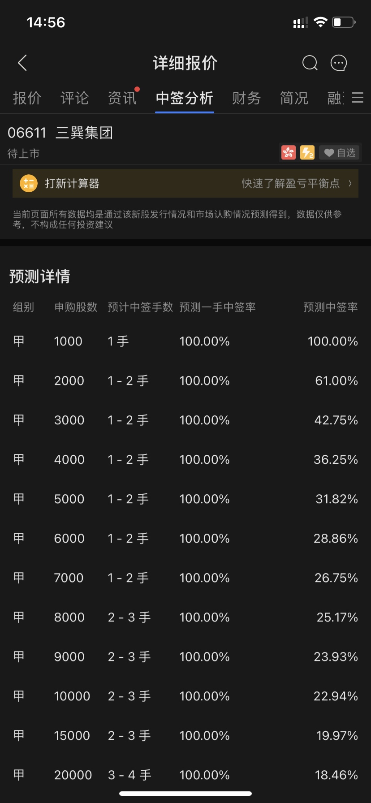
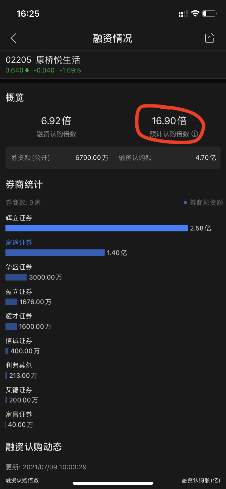
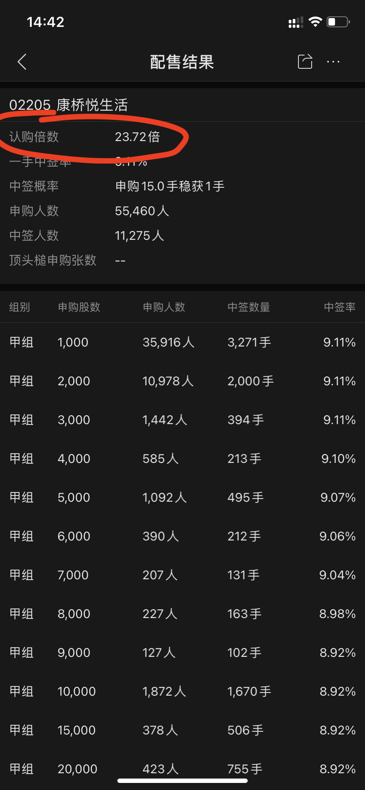
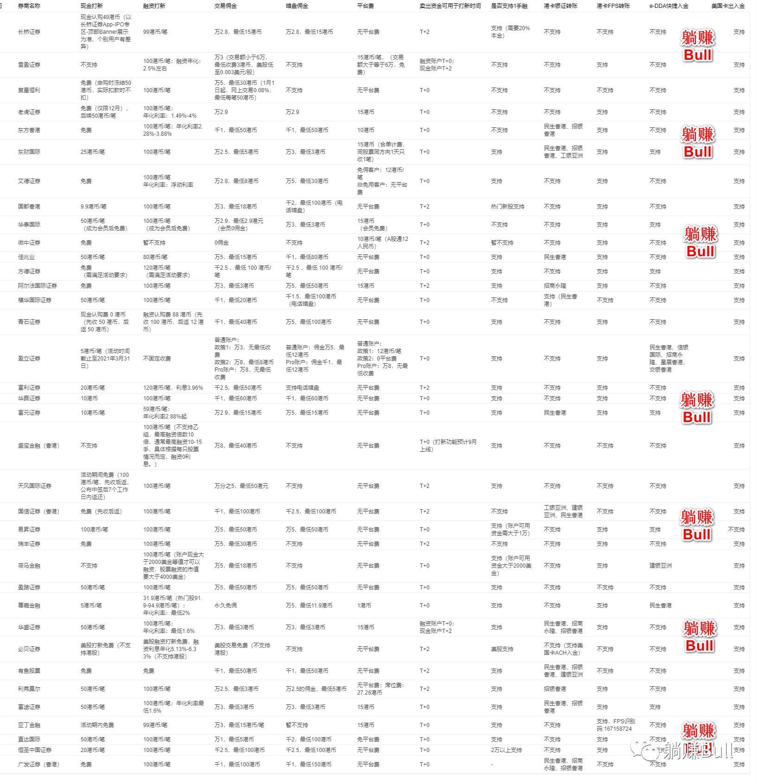
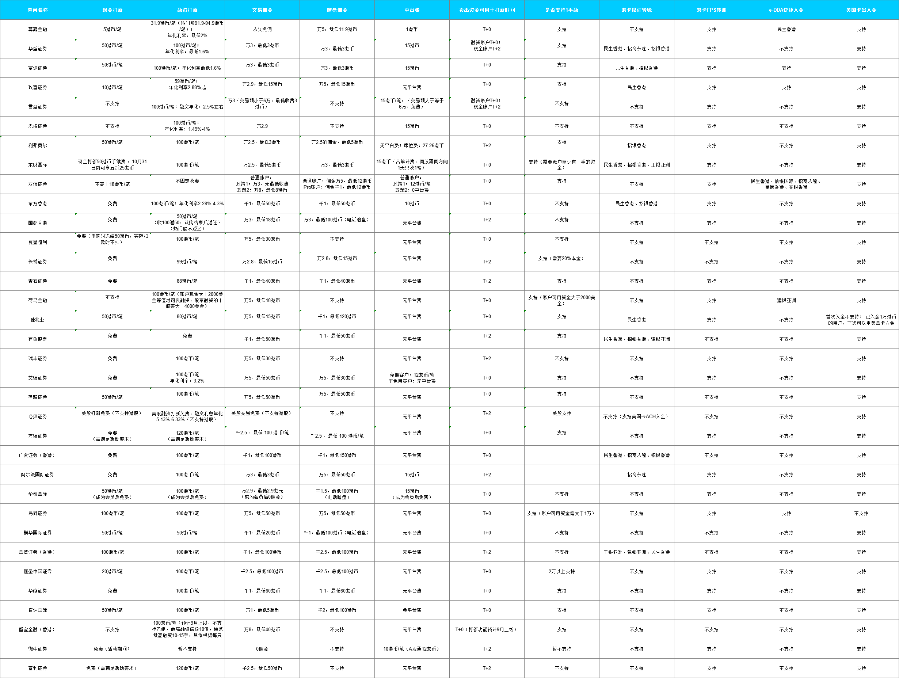
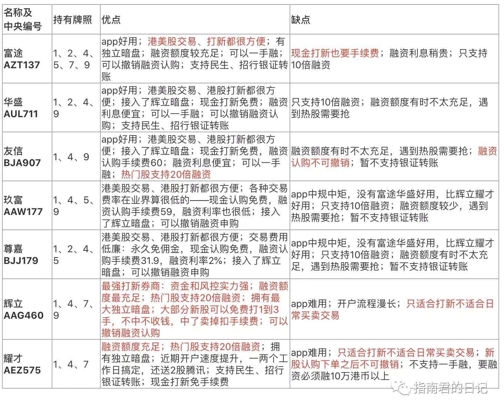

## 什么是一级市场和二级市场
+ 一级市场：中了打新的散户投资者（即甲组乙组，对应公开发售）；投资机构者（对应国际配售）
+ 二级市场：上市后进行的股票买卖

https://www.zhihu.com/question/36594463

## 公开发售和国际发售
公开发售针对散户；国际发售针对机构和高净值个人用户（证券账户现金超 100 万美元或 800 万港元）

投资者若参与了公开发售，就不能参加国际发售，同理，参与国际发售的投资者也不能再参与公开发售。

## 什么是回拨机制
港股新股发行分为公开发售（散户认购）和国际配售（机构投资者认购），通常公开发售占所有发行股份的 10%，国际配售占所有发行股份的 90%，但是这个不是一成不变的，上市公司 / 承销商可以根据认购倍数来调整公开发售和国际配售发行股份的比例，这就是回拨机制。

如果公开发售认购火热，则会根据散户认购总量达到初始发行量的多少被来确定回拨比例：

+ <15 倍：不回拨
+ 15~50 倍：启动回拨机制，至总发行量的 30%
+ 50~100 倍：启动回拨机制，至总发行量的 40%
+ >100 倍：启动回拨机制，至总发行量的 50%

如果公开发售认购不足，则会将股票回拨给国际发售；相反，如果国际发售认购不足，则会将股票回拨给公开发售，但是实际中如果国际发售不足，散户的认购热情也会很低，基本不可能回拨

## 什么是甲组和乙组
就公开发售这部分而言，即散户，一般被分为甲组和乙组

公开发售的股票在甲组和乙组平均分配，即甲组和乙组分别获得公开发售数量的 50%；甲组和乙组之间可以互相回拨。

同时规定，每个用户通过公开发售申购新股最大数量为公开发售总量的 50%，这个叫做顶头锤

+ 甲组：打新金额低于 500 万港元
+ 乙组：打新金额高于 500 万港元
+ 甲头：甲组第一档，即只买一手
+ 甲尾：甲组最后一档，认购资金达 400 多万，因为下一档就是 500 多万的乙头了
+ 乙头：乙组第一档，认购金额在 500 多万
+ 乙尾：也叫顶头锤，招股书说明最大可认购的数量，一般最多为公开发售数目（未计回拨）的一半，意谓最顶，不能再多，一般需要融资几千万甚至几个亿

如果是顶级保荐 + 顶级基石加持的明星大股，上涨概率很高，比如快手，就适合乙组融资打；否则一般甲组就够了

乙组跟甲组一样，优先保证每个人至少中签一手，然后再保证申购的越多，分配的也越多

## 为什么打新能赚钱
A 股和港股打新都能赚钱，是因为新股的发行价会设置得比较低，这样一级市场中拿到股票的人才会有盈利，从而吸引投资者积极认购，确保新股发行成功！

新股上市首日大概率是上涨的，当然也有可能破发

## 新股发行价是怎么定的
一只新股的发行价主要由机构投资者通过询价机制确定，反映了公司的内在价值，并有较为严格的监管，所确定的价格往往较为理性。而由于定价过程与上市后的价格形成机制存在差异，公司上市后股价往往在市场定价之下出现更大波动。

## 什么是股票破发
股票在二级市场中的价格，跌破它在一级市场中的发行价。
新股破发：上市当日价格跌破发行价

## 为什么是港股打新而不是 A 股
+ A 股：根据资金数量分配新股份额来确定购买数量
+ 港股：每个申购账户都被尽量保证能够打到一手新股。这就是红鞋机制。

## 港股新股配售的原则

+ 优先分配机制：照顾散户，优先尽量保证一人中签一手，力求人人有份，参与有奖的原则，因此一手中签率最高，随后递减。即红鞋机制
+ 申购越多分配越多机制：在优先分配机制的基础上，再次进行二次分配，就是申购的越多，分配的也越多

## 为什么中签率是这样？

1. 首先，我们看看这个中签率代表的含义，中签率 = 中签多少手/申购多少手，即每摸一手的中签概率
2. 可以看到，无论申购 1 手、2 手还是 3 手，中签率都是一样的；随着手数的增多，中签率逐渐下降
3. 注意，这个中签率是分段的，摸 1 手的中签率和摸 2 手、摸 10 手的中签率都是互相独立的。这里所谓的独立就是摸 2 手的概率并不是摸 1 手的概率的 2 倍。注意这里每一段的中签率都是被人为安排的，而不是什么巧合，安排的原则是红鞋机制+申购越多分配越多机制
3. 如何理解“申购 15 手稳中 1 手”？
    如何理解“稳中”这个词呢？申购 1 手的中签率是 9.11%，直觉上应该是 11 手稳中 1 手。但其实不是，即使每一手的概率都是 9.11 %，申购 999999999 手也不一定稳中，因为每一手是独立事件，没有稳中一说。这里之所以会有稳中，是因为港股的“申购越多分配越多机制”，申购足够多手的时候，会让其必中 1 手，再多的时候，会必中更多手。如下图，申购 8 手的时候已经是必中 2 手了

    

4. 区分好一手中签率和整体中签率。我们以上谈的都是一手中签率，随着手数的增多，一手中签率会越来越小，这意味着你的钱的利用率越来越低，但是却会提高你的整体中签率，整体中签率只是代表中到签而已。比如图 1 中申购 15 手的时候必中 1 手，即整体中签率已经是 100%。所以申购 1 手、2 手、3 手时整体中签率和一手中签率一样都是 9.11%，但是随着手数的增高，一手中签率降低，但是整体中签率是提高的，到了 15 手的时候已经 100% 了。通俗的讲就是，由于申购得越多，得到的手数可能会越多，这个就是“申购越多分配越多机制”的机制，这个也是融资的意义所在

## 为什么要多账户打新
港股的红鞋机制提高了一手中签率，同时也可以得出结论：二手中签率并不是一手中签率的两倍。

为了尽可能利用一手中签率高的这个特点，我们可以选择多账户打新

同一个券商，一个身份证只能开一个户；但一个身份证可以开通多个券商账户，所以选择多账户打新

## 如何判断这只股票要不要打
1. 有基石好于没有基石，有绿鞋要优于没有绿鞋
2. H 股不打：H 股大股东手中的股票以内资股形式持有，不能在港交所上市流通，内资股因为不能流通、不能质押，因此，股价涨跌基本与大股东没有直接利益关系，大股东也就没有动力搞市值管理。
3. 看同行估值：如果新股比二级市场同类公司估值还高，则破发风险高。基于这个理论，推导出以下行业不能打
    + 内地银行股：二级市场一堆 1 倍 PB（平均市净率）以下的银行股，你在一级市场按照 1 倍 PB 发，典型的高估值，这种新股不能打
    + 建筑与地产股：与内地银行股一样，二级市场的一堆 1 倍 PB 以下的公司
    + 券商股：券商股是典型的周期股，行情好的时候定价高，行情差的时候虽然定价低，但是市场不认可，没必要打。
    + 纺织服装类股：这类股在香港市场估值低，以往类似新股也表现不佳，没必要打
    + 港口航运股：这类公司估值便宜，行业市盈率低，甚至不少公司股价长期处于破净状态
    + 高速公路股：这类股在港股估值不高，不具备申购价值
    + 互联网金融股：尤其是 P2P 公司，过去几年的市场发展已经将互联网金融（下称互金）商业模式证伪。
5. 看募资额：大盘股一般都表现不佳，根据统计，募资额在 5 亿港元以上，但是认购倍数在 100 倍以下的，基本是个赔本买卖
6. 看超额认购倍数：超额越多，越火爆，首日上涨概率越大
    
7. 看保荐人的破发比例：香港本地券商破发比例 < 内地券商破发比例 < 国际大行破发比例。因为国际大行保的一般都是 10 亿港元以上的项目，对于这类公司，其估值比较准确，留给二级市场的碎银子就很少，甚至很多时候定价过高；而小券商之所以破发比例低，是因为他们保荐的都是小项目，容器炒作
8. 盲打创业板：因为创业板市值小，容易炒作

结论：看公众号就行

## 市净率
市净率 = 股价/每股净资产 = 市值/公司净资产

公司的净资产 = 公司的总资产减去负债之后的钱

每股净资产，对于股东来书，就是每一股能置换公司多少净资产的钱

通常每股净资产越高越好，每股净资产越高，股东拥有的资产现值越多；每股净资产越少，股东拥有的资产现值越少

低市净率意味着投资风险小，万一上市公司倒闭，清偿的时候可以收回更多成本。

市净率低于 1 的称为破净，意味着公司破产的时候，你拿 1 股的钱却换不到对应价值的净资产

市净率正常范围在 3-10 之间

## 融资（孖展）超额认购倍数
融资（孖展）超额认购倍数，即融资申购该股票的金额相比公开发售部分的倍数，并不包括现金申购部分的统计数据。因此，整体的超额认购倍数肯定要高于孖展超额认购倍数，但是孖展超额认购倍数毕竟可以提供有力的参考依据。

实际的认购倍数在新股上市之前查不到，只能根据融资情况来预估

实际的认购倍数在新股上市后可查

## 什么是绿鞋
绿鞋，即超额配售权，得名于美国绿鞋制造公司率先使用。

发行人（公司）会允许某一个承销商，**在新股发行后的一个月内**，超额发售不超过原计划 15％的股票

+ 发行人：公司
+ 承销商：也叫保荐人，一般是投资银行。是帮忙卖股票的角色

对于承销商而言，卖股票就是个销售的活儿，销售就是找客户，谁能找到最多的机构投资者来买拟上市公司的股票，拟上市公司当然就愿意让谁来承销

在大市行情好的情况下，新股上市后易出现暴涨；大市行情低迷时新股上市则面临破发风险。“绿鞋机制” 的引入，则是通过人为的方式对股票供需进行调节，起到稳定、平滑新股股价的作用。

绿鞋机制的本质是削峰填谷，在 1 个月内平抑和维护上市公司股价：当 IPO 公司上市后股价大涨，可以增发股票平抑股价；当公司上市后股价破发，可以通过在二级市场买入维持股价。

1. 若一家公司上市时决定发行 100 万股股份，承销商则将可从大股东手中额外借入 15 万股股份（这 15 万份股票是借，不需要给大股东钱，此时承销商就多了 15 万股票的钱）
2. 新股上市后，115 万股正式完成由一级市场向二级市场过度（此时市场上流通着 115 万股票，比计划多 15 万）
3. 当股价下跌时：承销商之前有额外的 15 万股票的钱，可以用来买入最大 15 万的股票，以此来实现 “护盘”，由于此时股价低于发行价，所以承销商赚了一笔差价。股票买回来后会归还给股东。这种情况下，绿鞋机制并未行使，因为市场上没有多余的 15 万的股票
4. 当股价上涨时：承销商不需要 “护盘”，因股价高于发行价，也不会在市场上买入股票还给股东（否则没钱赚）。此时承销商可行使 “绿鞋机制”，使上市公司增发总发行规模小于或等于 15% 的股票，把之前这 15 万股票的钱还予大股东。最终结果则是上市公司在二级市场中增发了≤15% 的股票。

当买回 15 万股票的时候，绿鞋机制没有行使；当买回低于 15 万的股票的时候，绿鞋机制部分行使；当没有买回任何股票的时候，绿鞋机制全额行使。

+ 对于上市公司而言，股票下跌时，绿鞋机制得以减少股价下跌幅度，保护了股东利益。当股票上涨时，发行人增发了一部分股票，一定程度消化了市场需求从而缓和了股价暴涨，并募得了额外资金
+ 对于承销商而言，当股价上涨时，因上市公司增发了股份，承销商将从中获得额外的佣金收入。当股票下跌时，其买入股票时价格与发行价间的中间差价则使其获得了额外收入。因此，对于承销商而言是笔稳赚的生意
+ 对于投资者而言，绿鞋机制使得其获得了更多股票供给，满足了其买入需求。当股价下跌时，因有承销商护盘，从而也有了出逃的机会，减少其损失风险，增加了市场认购的信心，申购意愿更强。

因此，“绿鞋机制” 简单而言是一种 “护盘机制”，多方受益

## 绿鞋套利
绿鞋套利：投资者可能会在公司上市破发时买入，然后将买入的股票再卖给稳定价格操作人

1. 绿鞋股票总数量相当于公司 IPO 时初始发行总量的 15%
2. “绿鞋与公开发售比”：就是用绿鞋保护的股数除以回拨以后公开发售的股数，这个比值越大，保护系数越高（其原理是破发后机构卖出的概率比散户小）
3. 如果卖盘上国际大行很多，建议放弃这类股票的绿鞋套利，一般情况下，国际发售部分占 IPO 公司初始发售量的 90%，以 15% 的绿鞋去接 90% 的 “飞刀”，显然是接不住的。
4. 绿鞋套利要趁早，最好再破发后前 3 天参与，如果破发后 3 天还没赚到钱就得及时止损跑路，其原理是刚破发时，稳定价格操作人手中有足够的额度买入；刚破发时尤其是上市首日若破发，公司形象易受损，为维护自己的形象，公司要宣传、要公关，此时维护股价的动力最为充足。等时间越来越长，很多公司就会任由股价自由落体了，而此时稳定价格操作人手中的额度已所剩无几。因此绿鞋套利要趁早   

> 哪些投资银行是国际大行？一般是指高盛、大摩、摩根大通、美银美林、花旗银行、瑞士银行、瑞士信贷、法国巴黎银行、德意志银行、巴克莱银行、汇丰银行、渣打银行、野村银行、星展银行等

## 什么是基石投资者
投资者尤其是散户投资者，做投资决策所倚靠的就是区区一份招股书，信息来源很有限。引入基石投资者，就是为了给市场一个相对有公信力的参考，一些明星基石投资者的加入会给股票的顺利上市打下坚实的基础。所以称之为 “基石”

**基石投资者是在公司港股 IPO 时，承诺以 IPO 价格认购一定数量的股份，且上市后锁定 6 个月以上**

基石投资者主要是一流的机构投资者、大型企业集团、以及知名富豪或其所属企业。

承销商会优先向基石投资者配发股票

可以看到，做基石投资者这是有风险的，所以如果一家准备上市的公司有基石投资者，就是对公司基本面和发展前景的最大肯定，而这会给市场带来很大信心

为什么有人愿意当基石投资者呢？

基石投资者的好处是可以保证分到确定额度的新股，在签署协议后，上市公司必须按发行价卖给基石投资者。实际情况是，对于火爆的新股，大家会抢破头当基石投资者，而发行人的积极性反而不高，因为机构投资者锁定股票后，会影响股票上市后的流动性。以阅文集团为例，该公司虽然募资总额超过 80 亿港元，但是发行前并未邀请基石投资者锁定股份，就是因为市场需求太火爆了。对于冷门的 IPO（如银行股的 IPO），大家当然是不愿意雪中送炭当基石投资者了，但是拟上市公司却急需基石投资者来支持，这就需要考验承销商的推销能力和拟上市公司的朋友圈了。

结论：可以简单认为，一只股票，基石投资者越多越好，认购比例越高越好

## 孖（mā）展申购
音同 margin，内地叫 “杠杆”，就是向券商借钱打新

**孖展申购要特别注意平仓风险**：如果跌幅过大，用户使用孖展如果中签数量过大，还可能被券商强行平仓。如果投资者以 10 倍孖展申购新股，然后 100% 中签，那么新股上市首日如果下跌 10%，投资者的新股就会被券商强行平仓；如果投资者以 20 倍孖展申购新股，申购后 100% 中签，那么新股上市首日下跌 5%，投资者的新股也会被券商强行平仓。虽然说这种极端情况出现的概率较小，但是一旦出现极端情况，投资者可能面临血本无归。

**切忌使用孖展申购冷门股**

## 打新中了什么时候卖
原则：打新不炒新，止盈止损

时机：暗盘；上市首日；上市后其他时间

港股是完全市场化的市场，新股上市首日不设涨跌幅限制。第一天收盘的定价，基本就已经决定了其合理价格，然后大部分新股价格会处于慢慢回落的状态。除非你对该公司和行业有深刻认识，否则尽量首日卖出。卖完后有资金继续下一轮打新

为什么打新不炒新？因为港股打新本质上是统计套利，炒新股就不是了。如果中的新股破发了就买入以平摊成本，就变成炒新股了。一般破发的也就中一手，亏损有限。据统计，2017 年 9 月 28 日至 2018 年 7 月 20 日，港股新股总计发行 181 家，其中仍然处于破发状态占比 70%，也就是说，在新股破发的时候买入以平摊成本这件事，有 70% 的概率是亏的

结论：

+ 暗盘大幅上涨，暗盘不卖
+ 暗盘涨幅不大，但上市首日低走的，建议及早卖
+ 暗盘破发无绿鞋，暗盘卖
    当中签的人知道暗盘破发时，心里的盘算都是第二天早上首日挂牌怎么能止损走人，结果就是羊群效应下越跌越惨
+ 暗盘破发有绿鞋，暗盘不卖
    不用过于担心，因为上市首日执行绿鞋机制的投资银行都会在发行价和发行价之下买入维持股价，毕竟上市首日老板在港交所敲钟，看着自己公司的股价狂跌，脸上也挂不住，人家也都是有头有脸的人
+ 暗盘既未大涨也未大跌，建议首日卖出
    港股打新是耐力赛不是短跑。有绿鞋保护的新股如果首日下跌，投资者可以再等一等
+ 首日卖出 > 上市后其他时间卖出
+ 首日收盘卖出 ＞ 首日开盘卖出

## 什么是银证转账、FPS、eDDA
### 银证转账
概念：券商账户绑定香港银行卡
优点：
缺点：很多港股券商不支持银证转账，很多港卡也不支持银证转账

### 快速支付系统（FPS：Faster Payment System）
概念：快速支付系统（转数快）。类似支付宝转账，只要知道对方的 FPS 号，就可以直接转账
优点：即时跨行转账；免费；2 小时内到账；基本所有券商都支持 FPS
缺点：大多数香港银行卡的 FPS 每笔转账金额不能大于 1 万港币

### eDDA
概念：FPS 转数快系统增值服务。支持客服授权券商从指定银行账户将资金存入证券账户（类似自动扣款）
优点：5 分钟内到账；免费；可直接在券商 APP 发起操作，无需至银行操作
缺点：目前支持 eDDA 入金的券商比较少

## 新股确定发行价的方式
1. 申购前已经确定最终发行价，这种情况比较少
2. 申购前确定发行价区间，最终根据机构投资者的认购情况确定最终发行价，有灵活定价机制，可以在发行价下限降价 10% 发行

如果发行不成功（比如定价过高，认购不足），有以下几种情况：
1. 公司重新降价发行，需要重走流程
2. 公司取消发行，老子不玩了
3. 公司采用灵活定价机制，降价 10% 发行，好处就是不需要降价然后重新走发行的流程

港交所引入新股发行灵活定价机制的本意是让拟上市公司根据申购情况灵活调整发行价，而不用撤回并重新进行招股，因为采用该机制不会触发撤回机制而导致额外成本及招股延迟。

## 什么是同股不同权
所谓 “同股不同权”，也就是 “AB 股结构”，其中 A 类股为普通股，B 类股为特别股，B 股所拥有的表决权，是 A 股的数倍之多，而这类股份一般由管理层持有，而管理层普遍为始创股东及其团队。A 类股一般为外围股东持有，此类股东看好公司前景，因此甘愿牺牲一定的表决权作为入股筹码。

对于同股不同权公司在港交所上市，港交所要求拟上市公司属于创新产业，公司业务有高成长记录，并且公司曾获得第三方投资，公司市值最少 100 亿港元，如预期市值少于 400 亿港元要求最近一年的收入不低于 10 亿港元，不同投票权架构下的受益人必须在上市后一直担任公司董事，受益人的投票权不得超过普通股投票权的 10 倍，上市后在公司名称后加 “W” 标记。
同股不同权公司的规定主要是吸引小米、滴滴等内地创新公司在港上市。目前有小米集团 - W（01810.HK）、美团点评 - W（03690.HK）、百度 - SW（09888.HK）和哔哩哔哩 - SW（09626.HK）等

## 港股打新和 A 股打新区别
+ A 股申购时无须冻结资金。港股需要
+ A 股打新需要证券账户下持有 A 股市值，方具备打新资格，持有沪市市值只能打沪市新股，持有深市市值只能打深市新股。港股打新无须持有证券市值，投资者证券账户下有现金即可申购港股新股。
+ A 股的中签率低。港股打新中签率高
+ A 股打新户数多。港股打新户数少
+ A 股新股无破发风险，基本上只要中签就能赚钱。港股打新有破发风险
+ A 股新股发行价非完全市场化，规定市盈率不得高于 23 倍。港股新股定价是市场化定价
+ A 股新股发行分为网上发行和网下发行，网上发行针对散户，网下发行主要针对机构投资者和证券账户股票市值在 6000 万以上的高净值个人用户。A 股网上发行根据抽签确定，网下发行按照机构投资者和高净值个人用户的不同分为 A、B、C 三类，按照不同比例分配新股。港股新股发行分为公开发售和国际发售
+ A 股打新无申购费用，不可融资；港股打新需要申购费，可以融资申购
+ A 股新股申购期较短，一般 T 日申购，申购日仅 1 天，中签后 T+2 日缴款；港股新股申购期较长，一般申购期为 3.5 天
+ A 股无暗盘，上市首日最高涨幅为 44%；港股有暗盘，涨幅无限制

## 港股打新费用
+ 新股申购费：由券商收取，有些券商免费；无论是否中签都收
+ 交易征费：由香港证监会收取，费率为申购金额的 0.0027%，最低为 0.01 港元；未中签不收
+ 交易费：由香港交易所收取，费率为申购金额的 0.005%，最低为 0.01 港元；未中签不收
+ 孖展申购利息：由券商收取；无论是否中签都收
+ 印花税：由香港特区政府征收，税率为交易额的 1‰；中签才收
+ 券商佣金：多数互联网券商交易佣金约为 5‱；中签才收

## 百分百中签一定破发吗
根据统计，2017-2018 的数据，百分百中签的新股中，暗盘破发比例为 31%，首日破发比例也为 31%，故不需要太担心

## 港股打新小提示
1. 暗盘套利：不同券商的暗盘价格不一样，可以在 A 券商的暗盘高价卖出然后在 B 券商的暗盘低价买入。注意手续费
2. 暗盘不会有绿鞋

## 二次上市之后，市值岂不是翻倍？
对于 A 股和港股，市值确实是累加的；但对于港股和美股，市值是独立的，比如

你有 10 瓶水，在超市 1 瓶卖 1 元，那总价值为 10 元；如果是在酒店卖，1 瓶 10 元，那总价值是 100 元。

二次上市，就是 10 瓶水不变，有 5 瓶从超市拿到酒店卖而已。

不过由于港股和美股之间没有壁垒，所以基本上两地市值一样

## 券商对比

