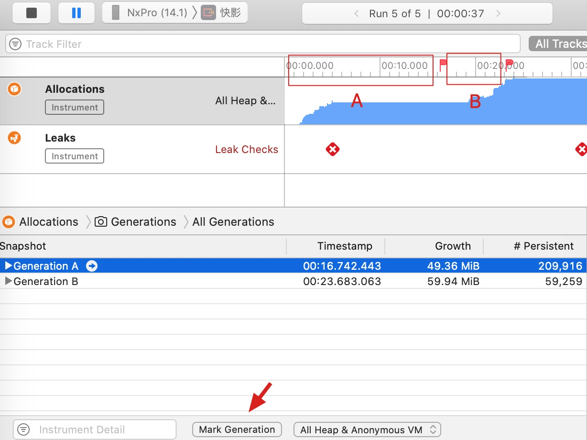

## Instruments 的 Leak

使用 Make Generation 标记，如图所示。

+ Generation A 的内存占用表示的是，是从启动到标记 A 点的时候的内存增量
+ Generation B 的内存占用表示的是，是从标记 A 的时候到标记 B 点的时候的内存增量

点击具体的内存占用，如果右侧没有显示堆栈，则需要修改 Xcode 的 Build Settings -> Debug Information Format，打开 Debug 下的 DWARF with dSYM File

